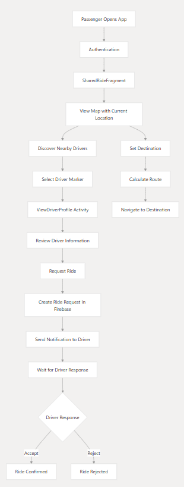
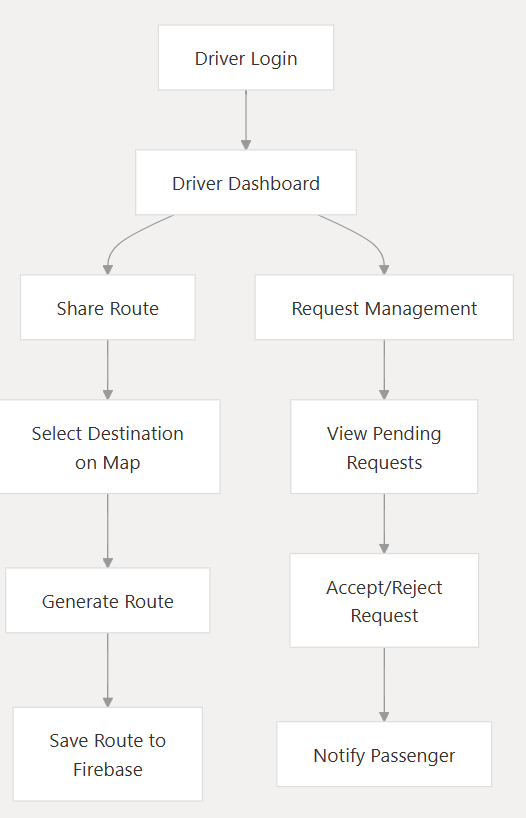
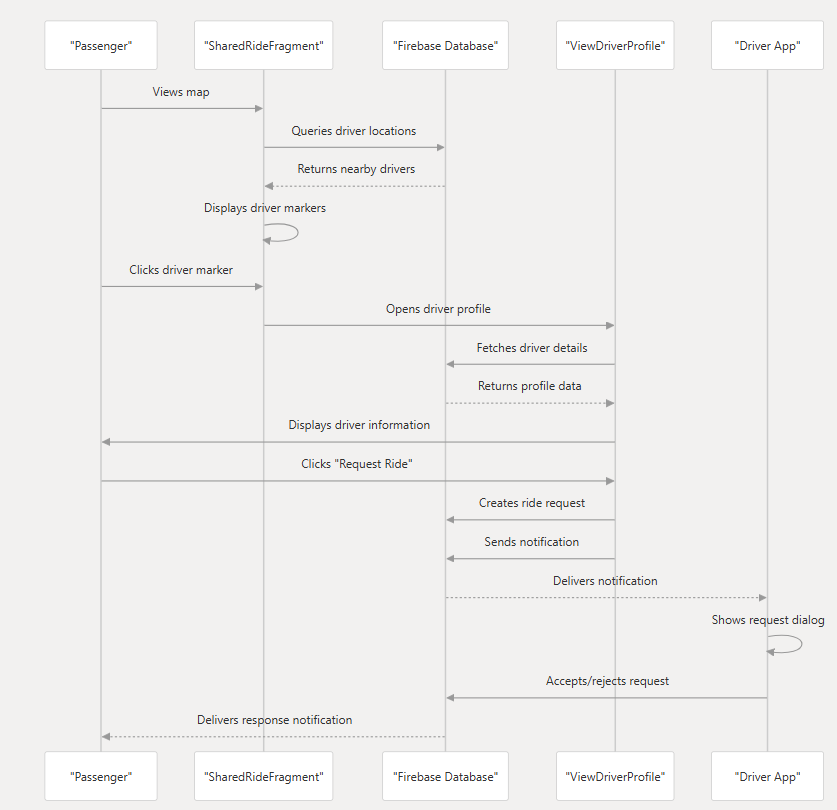
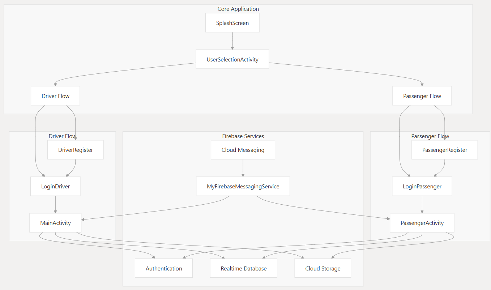
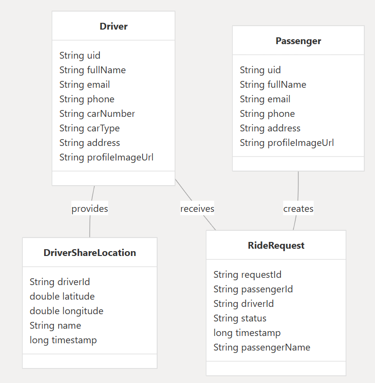

# Carpooling App

An Android-based carpooling application designed to bridge the gap between drivers and passengers. This application offers a seamless, real-time platform for users to find, book, and share rides, with a strong focus on user experience, safety, and efficiency. It features distinct interfaces for both drivers and passengers, each tailored to their specific needs.


---

_Note : This is our Final Year Project for our B.E in Computer Systems Engineering._  

## Contributors : 
_[UROOJ MARVI](https://github.com/urooj-marvi)_
_[ABDUL BASIT MEMON](https://github.com/abm1119)_
---

## Table of Contents
- [Introduction](#introduction)
- [Features](#features)
  - [Core Features](#core-features)
  - [Passenger Features](#passenger-features)
  - [Driver Features](#driver-features)
- [How It Works: Flowcharts](#how-it-works-flowcharts)
  - [Passenger Workflow](#passenger-workflow-flowchart)
  - [Driver Workflow](#driver-workflow-flowchart)
- [System Architecture & UML Diagrams](#system-architecture--uml-diagrams)
  - [Architectural Pattern](#architectural-pattern)
  - [UML Use Case Diagram](#uml-use-case-diagram)
  - [UML Component Diagram](#uml-component-diagram)
- [Firebase Integration](#firebase-integration)
- [Database Schema (ER Diagram)](#database-schema-er-diagram)
- [API & External Services](#api--external-services)
- [Project Structure](#project-structure)
- [Getting Started](#getting-started)
  - [Prerequisites](#prerequisites)
  - [Installation & Setup](#installation--setup)
- [Screenshots](#screenshots)
- [Contributing](#contributing)
- [License](#license)
- [Contact](#contact)

---

## Introduction

The Carpooling App is a mobile solution aimed at making daily commutes more affordable, environmentally friendly, and sociable. By connecting drivers with empty seats to passengers traveling along the same routes, the app helps reduce traffic congestion and carbon emissions. It is built using native Android (Java) and leverages the power of Firebase for its backend services, ensuring real-time data synchronization and a responsive user experience.

---

## Features

### Core Features
- **Dual User Roles:** Separate and intuitive interfaces for Passengers and Drivers.
- **Secure Authentication:** Robust email/password and social login using Firebase Authentication.
- **Real-time Notifications:** Instant alerts for ride requests, confirmations, and cancellations via Firebase Cloud Messaging (FCM).
- **Profile Management:** Users can create and manage their profiles with personal details and profile pictures.

### Passenger Features
- **Ride Selection:** Options to book a "Shared Ride" for a cost-effective journey or a "Personal Ride" for a private trip.
- **Interactive Map:** Utilizes Mapbox to display a live map of available drivers within a 3km radius.
- **Driver Discovery:** View detailed driver profiles, including name, vehicle information, ratings, and user reviews.
- **Seamless Booking:** Send ride requests to drivers with a single tap.
- **Route Visualization:** Input pickup and drop-off locations to see the planned route on the map.
- **Live Tracking:** Track the driver's location in real-time once a ride is confirmed.

### Driver Features
- **Route Broadcasting:** Share planned routes to attract potential passengers.
- **Ride Request Management:** A dedicated dashboard to view, accept, or decline incoming ride requests.
- **Passenger Information:** Access passenger details upon accepting a request.
- **Real-time Location Sharing:** Broadcast current location to passengers for easy pickup coordination.
- **Earnings Dashboard:** (Future Scope) Track earnings from completed rides.

---

## How It Works: Flowcharts

The application flow is designed to be straightforward for both user types.

### Passenger Workflow (Flowchart)
1.  **Onboarding:** The passenger signs up or logs in.
2.  **Dashboard:** They are presented with options for a 'Shared' or 'Personal' ride.
3.  **Ride Search:**
    - For a **Shared Ride**, the passenger sees available drivers on the map who are sharing their routes.
    - For a **Personal Ride**, the passenger sets their destination, and the app notifies nearby drivers.
4.  **Booking:** The passenger selects a driver and sends a ride request.
5.  **Confirmation:** The passenger receives a notification once the driver accepts the request.
6.  **Trip:** The passenger can track the driver's approach and enjoy the ride.


*[Diagam: Passenger Workflow]*

### Driver Workflow (Flowchart)
1.  **Onboarding:** The driver registers with their vehicle details and logs in.
2.  **Dashboard:** The driver can choose to 'Share Route'.
3.  **Sharing a Route:** The driver inputs their destination, making their trip visible to passengers.
4.  **Receiving Requests:** The driver gets notified of ride requests from passengers.
5.  **Accept/Decline:** The driver can review the passenger's request and decide to accept or decline.
6.  **Trip:** Upon acceptance, the driver proceeds to the pickup location, and their location is shared with the passenger.


*[Diagram: Driver Workflow]*

---

## System Architecture & UML Diagrams

### Architectural Pattern
The application follows the **Model-View-ViewModel (MVVM)** architectural pattern. This separation of concerns ensures that the codebase is modular, scalable, and easy to maintain.

- **View (Activities/Fragments):** Responsible for the UI and capturing user input. It observes the ViewModel for data changes and updates the UI accordingly.
- **ViewModel:** Acts as a bridge between the View and the Model. It holds the UI-related data in a lifecycle-conscious way and exposes it to the View.
- **Model:** Represents the data and business logic. It interacts with the backend (Firebase) and provides data to the ViewModel.


*[Diagram: Workflow Diagram]*

### UML Use Case Diagram
This UML diagram illustrates the primary functions (use cases) of the system and the different users (actors) that interact with them. It provides a high-level view of the system's functionality.


*[Diagram: Core Architechture Diagram]*

### UML Component Diagram
This UML diagram shows the high-level components and their interactions within the app, highlighting the modular structure.


*[Diagram: Role Saperation Diagram]*

---

## Firebase Integration

Firebase forms the backbone of the application:

- **Firebase Realtime Database:** Used for storing and syncing data in real-time. This includes user profiles, ride details, and location data.
- **Firebase Authentication:** Handles all aspects of user authentication, providing a secure and easy-to-implement login system.
- **Firebase Storage:** Used for storing user-generated content like profile pictures and vehicle images.
- **Firebase Cloud Messaging (FCM):** Powers the push notification system for real-time alerts.

---
## Database Schema (ER Diagram)

Our Firebase Realtime Database is structured as a JSON tree. The following illustrates the relationships between the main data entities.

```json
{
  "Users": {
    "Drivers": {
      "driver_uid_1": {
        "name": "John Doe",
        "email": "john.doe@example.com",
        "phone": "123-456-7890",
        "profileImageUrl": "url_to_image",
        "carName": "Toyota Corolla",
        "carNumber": "XYZ-123",
        "userType": "Driver"
      }
    },
    "Passengers": {
      "passenger_uid_1": {
        "name": "Jane Smith",
        "email": "jane.smith@example.com",
        "phone": "098-765-4321",
        "profileImageUrl": "url_to_image",
        "userType": "Passenger"
      }
    }
  },
  "RideRequests": {
    "driver_uid_1": {
      "request_id_1": {
        "passengerId": "passenger_uid_1",
        "pickupLocation": {
          "latitude": 34.0522,
          "longitude": -118.2437
        },
        "destination": {
          "latitude": 34.1522,
          "longitude": -118.3437
        },
        "status": "pending"
      }
    }
  },
  "SharedRides": {
    "driver_uid_1": {
      "startLocation": { "latitude": 0, "longitude": 0 },
      "endLocation": { "latitude": 0, "longitude": 0 },
      "availableSeats": 3,
      "timestamp": 1678886400
    }
  },
  "DriverLocations": {
    "driver_uid_1": {
      "latitude": 34.0522,
      "longitude": -118.2437,
      "timestamp": 1678886400
    }
  }
}
```

*[Caption: Firebase Database Schema]*
---

## API & External Services

- **Mapbox SDK:** The core of our mapping functionality. We use it for:
  - Displaying interactive maps.
  - Plotting user and driver locations with custom markers.
  - Calculating routes and displaying them on the map.
  - Geocoding and reverse geocoding.
- **Firebase Cloud Messaging (FCM):** Used for sending and receiving push notifications between the app and the server.

---

## Project Structure

The project is organized into logical packages to maintain a clean and understandable structure.

```
com.urooj.carpoolingapp
│
├── adapter            # RecyclerView adapters
├── services           # Background services
│
├── driverui
│   ├── activities     # Activities for the driver
│   ├── fragments      # Fragments for the driver UI
│   └── DriverModel    # Data models specific to the driver
│
├── passengerui
│   ├── activity       # Activities for the passenger
│   ├── fragment       # Fragments for the passenger UI
│   └── PassengerModel # Data models specific to the passenger
│
├── SplashScreen.java
└── UserSelectionActivity.java
```

---

## Getting Started

Follow these instructions to get a copy of the project up and running on your local machine.

### Prerequisites
- Android Studio (latest version)
- Java JDK 11 or higher
- An active Firebase project
- A Mapbox account and a public access token

### Installation & Setup

1.  **Clone the repository:**
    ```sh
    git clone [https://github.com/urooj-marvi/carpooling_app.git](https://github.com/urooj-marvi/carpooling_app.git)
    ```

2.  **Open in Android Studio:**
    - Launch Android Studio.
    - Select `File > Open` and navigate to the cloned project directory.

3.  **Firebase Configuration:**
    - Go to your Firebase Console and create a new project.
    - Add an Android app to your project with the package name `com.urooj.carpoolingapp`.
    - Download the `google-services.json` file and place it in the `app/` directory of your project.
    - Enable **Email/Password Authentication** in the Firebase Authentication section.
    - Set up the **Realtime Database** and configure its security rules. For development, you can start with:
      ```json
      {
        "rules": {
          ".read": "auth != null",
          ".write": "auth != null"
        }
      }
      ```

4.  **Mapbox Configuration:**
    - Log in to your Mapbox account and find your public access token.
    - Open the `app/src/main/res/values/strings.xml` file.
    - Replace `YOUR_MAPBOX_ACCESS_TOKEN` with your actual token:
      ```xml
      <string name="mapbox_access_token">YOUR_MAPBOX_ACCESS_TOKEN</string>
      ```

5.  **Build and Run:**
    - Sync the project with Gradle files.
    - Build and run the app on an Android emulator or a physical device.

---

## Screenshots


*Figure: App Screens*

---

## Contributing

Contributions are what make the open-source community such an amazing place to learn, inspire, and create. Any contributions you make are **greatly appreciated**.

If you have a suggestion that would make this better, please fork the repo and create a pull request. You can also simply open an issue with the tag "enhancement".

1.  Fork the Project
2.  Create your Feature Branch (`git checkout -b feature/AmazingFeature`)
3.  Commit your Changes (`git commit -m 'Add some AmazingFeature'`)
4.  Push to the Branch (`git push origin feature/AmazingFeature`)
5.  Open a Pull Request

---

## License

Distributed under the MIT License. See `LICENSE` for more information.

---

## Contact

Urooj Marvi - uroojriaz048@gmail.com
Abdul Basit - basitmemon67@gmail.com


Project Link: [https://github.com/urooj-marvi/carpooling_app](https://github.com/urooj-marvi/carpooling_app)